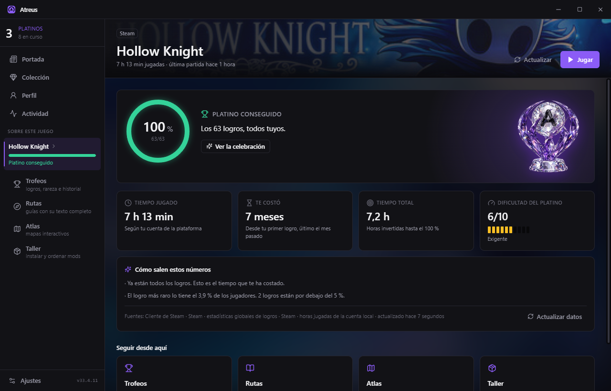
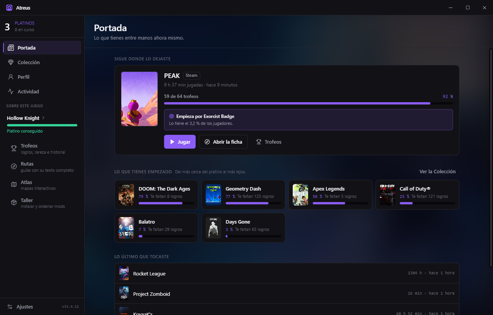
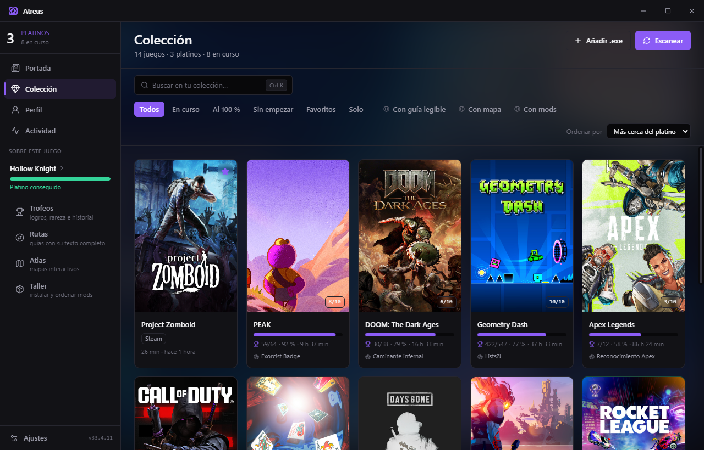
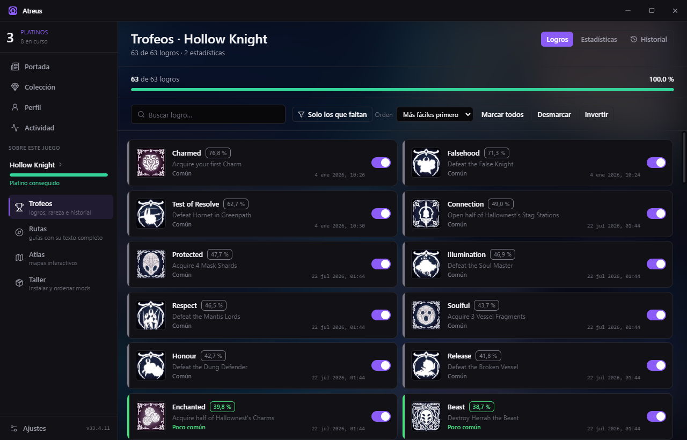
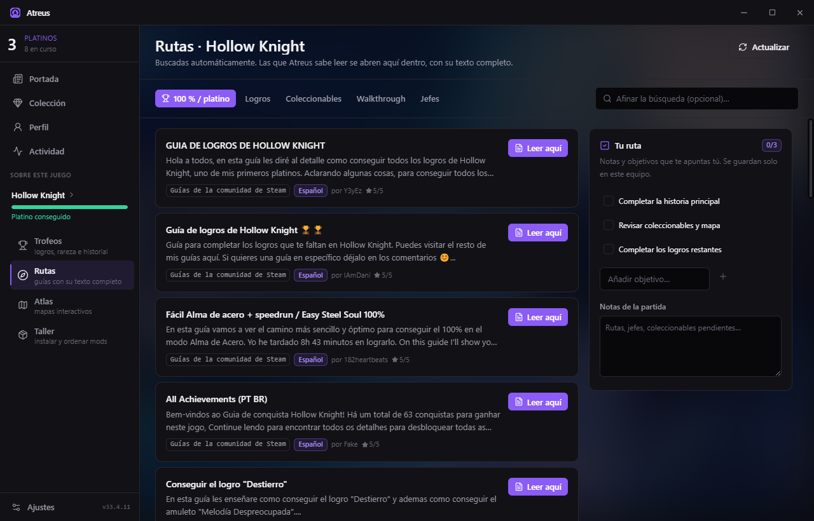
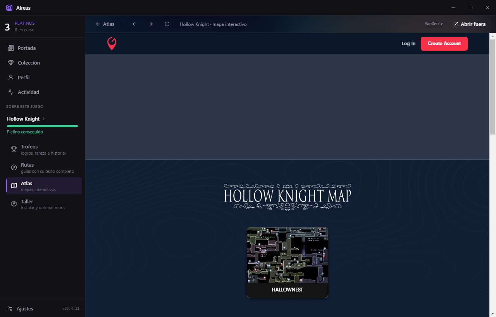
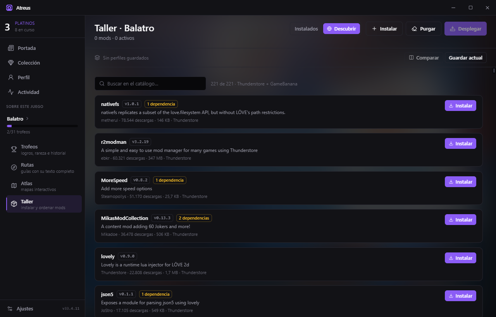
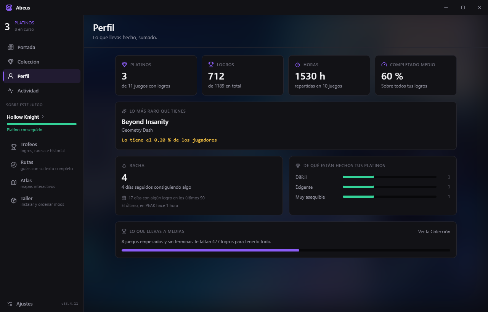
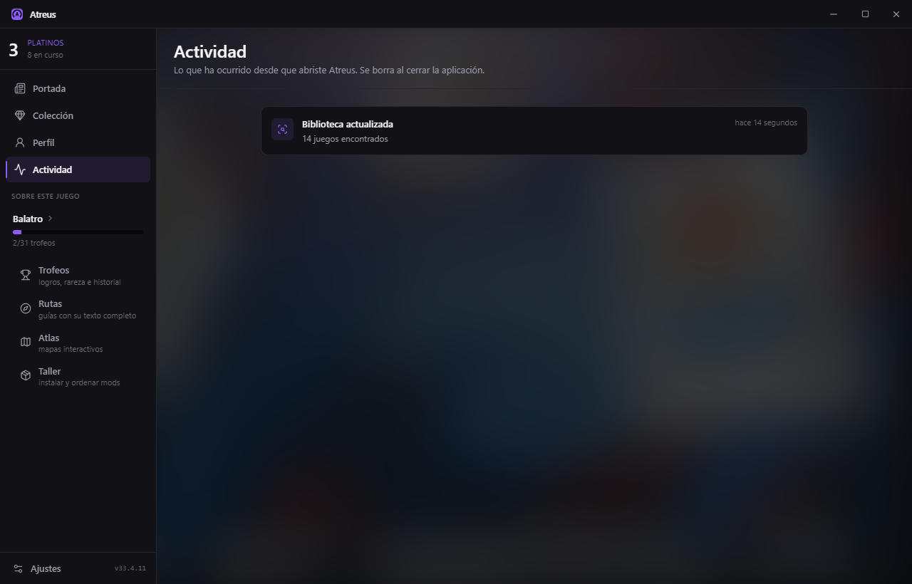
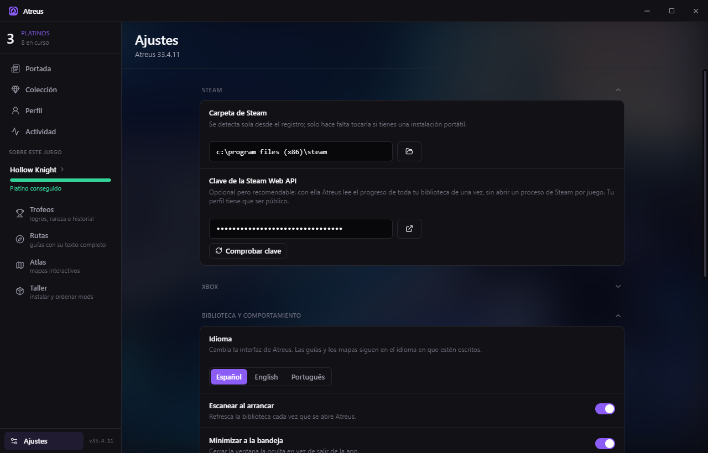

# Atreus

Aplicación de Windows para **cazar platinos**: saber qué te falta para el
100 % de logros de cada juego, cuánto te va a costar, leer las guías que lo explican y
abrir los mapas donde está cada cosa — todo dentro de la misma ventana.

Gratis. Sin cuentas, sin anuncios y sin telemetría: Atreus no manda nada a
ninguna parte. Ver [docs/SCOPE.md](docs/SCOPE.md).



## Descargar

**[→ Descarga la última versión](https://github.com/syaxag/atreus/releases/latest)** · Windows 10 u 11, 64 bits.

Bájate el `Atreus-<versión>-setup.exe` de la sección *Assets* y ábrelo. No hace falta
tener nada más instalado.

> **Windows te va a avisar** de que no reconoce al editor, y tiene razón: firmar un
> ejecutable cuesta un certificado de pago que este proyecto no tiene. Pulsa
> *Más información* → *Ejecutar de todas formas*. Si prefieres no fiarte de eso
> —haces bien—, el código está entero aquí y puedes compilarlo tú: mira *Arrancar*.

A partir de ahí Atreus se actualiza solo cuando hay versión nueva, sin configurar
nada: viene apuntando a estas mismas releases.

Es gratis y puedes usarlo en los equipos que quieras, pero **no se puede
redistribuir**: si quieres pasárselo a alguien, pásale este enlace. Los términos
completos, en [LICENSE](LICENSE).

## Cómo es por dentro

Nueve pantallas. Cuatro valen siempre y cuatro operan sobre **el juego que
tengas elegido**, que vive en medio de la barra lateral con su progreso a la
vista. Esa separación es la que hace que "Trofeos" o "Atlas" signifiquen algo:
sin un juego delante no significan nada, y por eso van debajo de él y sangrados.

---

### Portada — lo que tienes entre manos ahora mismo



Atreus no abre por la parrilla de juegos, porque una parrilla te obliga a
decidir antes de saber nada. Abre por aquí, que compone lo que ya sabe:

- **Sigue donde lo dejaste** — el juego que está abierto ahora o el último que
  tocaste, con su progreso y **por qué logro seguir**. En la captura: PEAK, 59
  de 64 trofeos, y el siguiente es *Exorcist Badge*, que lo tiene el 3,2 % de
  los jugadores. Eso convierte la tarjeta en una decisión y no en un recordatorio.
- **Lo que tienes empezado**, del más cerca del platino al más lejos.
- **Lo último que tocaste**, que es lo que se quedó por el camino.

Arriba a la izquierda, el marcador de la casa: cuántos platinos llevas y cuántos
estás persiguiendo. Es el número que da nombre a la aplicación.

---

### Colección — tu estantería, ordenada por lo que falta



Detecta solo los juegos de **Steam, Epic, GOG, EA y Xbox**, y admite ejecutables
sueltos con *Añadir .exe*. Cada tarjeta lleva el póster vertical, el progreso
real, las horas y **el siguiente logro** que te toca.

El orden por defecto es *más cerca del platino*. Los filtros de arriba son los
que se usan de verdad cuando cazas: **En curso**, **Al 100 %**, **Sin empezar**,
**Favoritos**, y tres que no tiene ningún launcher — **con guía legible**, **con
mapa** y **con mods**, para saber de un vistazo con qué juego puedes ponerte
ahora mismo.

El número en la esquina de la carátula es la **dificultad del platino**, de 1 a
10. Va sobre el arte y no en el texto porque es una propiedad del juego, no de
tu progreso.

---

### Ficha del juego — la pantalla para la que existe la aplicación


Responde de un vistazo a las cuatro preguntas de quien caza un platino:

| | |
|---|---|
| **Cuánto llevas** | El anillo, con los logros hechos sobre el total |
| **Cuánto te ha costado ya** | Horas de tu cuenta, y **cuánto llevas persiguiéndolo** desde el primer logro |
| **Cuánto te queda** | Una estimación en horas, no un "quedan 12 logros" |
| **Cómo de duro es** | La dificultad del platino, calculada con la rareza global de lo que falta |

Y debajo, **cómo salen esos números**: de dónde viene cada dato y cuándo se
calculó. Atreus no te pide que te fíes de una cifra sin decirte de dónde sale.

Al llegar al 100 % el trofeo preside la tarjeta, como en la captura.

---

### Trofeos — logros, rareza e historial



Funciona con juegos **de cualquier tienda**, y dice siempre de dónde saca el
estado:

- **Steam** — del cliente, con tu propia sesión. Los lee y **puede
  desbloquearlos**, avisando antes de lo que eso significa.
- **Xbox** — con tu clave de OpenXBL, con sus fechas y su rareza.
- **Epic, EA, GOG** — la lista sale del catálogo público de Steam y el progreso
  lo marcas tú, porque esas plataformas no lo publican sin iniciar sesión.

Cada logro lleva **su rareza global**: qué porcentaje de jugadores lo tiene. Es
lo que permite ordenar por *más fáciles primero* —por donde conviene empezar— o
buscar directamente el que va a doler. Las otras dos pestañas son las
**Estadísticas** del juego y el **Historial** de copias de seguridad: antes de
escribir nada, Atreus guarda cómo estaba, y desde ahí se vuelve atrás.

---

### Rutas — las guías, con su texto completo, aquí dentro



No es un buscador: tú eliges **qué tipo de ayuda** quieres —100 % / platino,
logros, coleccionables, walkthrough, jefes— y Atreus va a buscarla a la
comunidad de Steam y a las wikis del juego.

Las que sabe leer se abren **dentro de la aplicación**, con su texto entero, sus
imágenes y su atribución. Las que no dejan extraerse se marcan como tales en vez
de abrirse en una hoja en blanco, que es lo que hace todo lo demás.

A la derecha, **tu ruta**: objetivos y notas que te apuntas tú y se guardan solo
en este equipo.

---

### Atlas — el mapa interactivo de verdad, integrado



Atreus **no redibuja** ningún mapa: abre el del proveedor —MapGenie o la wiki
del juego— en una pestaña con su propia barra de navegación, como se ve arriba.
Lo que marcas en el mapa se queda marcado, porque es el mapa real.

Y va rápido. Esa pestaña **no carga los marcos de terceros**: medido en un mapa
de MapGenie, 479 subframes de sincronización entre redes de anuncios que hacían
que el mapa estuviera listo a los 5 segundos y la página no callara hasta los 29.

Si un juego no tiene mapa en ningún sitio, puedes **añadir uno a mano**; se
guarda en la ficha del juego y se puede compartir con quien quieras.

---

### Taller — instalar y ordenar mods, sin miedo



Dos pestañas. **Instalados** es tu lista, con su orden de carga y sus perfiles.
**Descubrir** es el catálogo público del juego: en la captura, 221 mods de
Thunderstore y GameBanana para Balatro, con descargas, tamaño y dependencias.

Lo que lo distingue de copiar archivos a mano:

- **Activar no es desplegar.** Un mod activo vive en el almacén de Atreus y no
  toca el juego hasta que pulsas *Desplegar*.
- **El despliegue es reversible.** Se usan enlaces duros, así que no ocupa el
  doble, y todo lo que se escribe queda anotado. Si un mod pisa un archivo del
  juego, el original se aparta. **Purgar** deshace las dos cosas y el juego
  vuelve exactamente a como estaba.
- **Los conflictos se ven antes**, no después de que el juego no arranque.

---

### Perfil — lo que llevas hecho, sumado



Cada ficha cuenta su juego; esta cuenta al jugador. Platinos, logros totales,
horas, completado medio, **el trofeo más raro que tienes**, tu racha de días
seguidos consiguiendo algo, y de qué dificultades están hechos tus platinos.

No abre una sola sesión de Steam ni pide nada: todo se recorta de informes que
ya estaban calculados.

---

### Actividad y Ajustes

<table>
<tr>
<td width="50%"></td>
<td width="50%"></td>
</tr>
<tr>
<td><b>Actividad</b> — lo que ha pasado desde que abriste Atreus: escaneos,
juegos abiertos y cerrados, platinos, cambios en el Taller. Se borra al cerrar.</td>
<td><b>Ajustes</b> — la carpeta de Steam (se detecta sola), las dos claves
opcionales, el idioma —castellano, inglés y portugués—, el catálogo de
definiciones y las actualizaciones.</td>
</tr>
</table>

---

### Y la celebración

Cuando rematas un platino y vuelves a la aplicación, salta: la animación del
trofeo de Atreus, el nombre del juego y lo que te costó. No se enseña aquí
porque es un vídeo y en una captura no se entiende — ábrela y consíguelo.

---

## De dónde salen los datos

Nada de esto necesita clave de API ni cuenta:

- **Logros y sus fechas** — del cliente de Steam, con tu propia sesión. Para un juego
  de otra tienda, la lista sale del catálogo público de Steam: casi todo lo que hay en
  Xbox, Epic o EA está también ahí, y su lista de logros es la misma.
- **Rareza de cada logro** — de las estadísticas globales públicas de Steam. Es lo que
  permite decir si un platino es asequible o brutal, y qué logro es el que va a doler.
- **Horas jugadas** — del `localconfig.vdf` de tu instalación de Steam. Para las
  plataformas que no publican horas, Atreus cuenta las sesiones que ve.
- **Guías** — de la comunidad de Steam y de las wikis del juego (wiki.gg, Fandom).
- **Mapas** — del directorio público de MapGenie y, si el juego no está ahí, de su wiki.

Para los juegos de **Xbox** hay una segunda clave, la de [OpenXBL](https://xbl.io):
la generas entrando con tu cuenta de Microsoft en su web y Atreus solo maneja la clave,
nunca tu contraseña. Con ella los logros de Xbox se leen solos, con sus fechas y su
rareza; sin ella se usa la lista de la versión de Steam y el progreso lo marcas tú.

La clave de la Steam Web API que hay en Ajustes es opcional, pero merece la pena: con
ella Atreus lee el progreso de toda la biblioteca en una petición por juego, en vez de
abrir un proceso de Steam por cada uno. Hay un botón para comprobarla, porque una clave
mal pegada o un perfil privado fallan sin decir nada.

## Arrancar

```bash
npm install
```

```bash
npm run dev:mock
```

`dev:mock` levanta la interfaz contra un backend falso — no necesita Steam ni juegos
abiertos. Para el backend real:

```bash
npm run dev
```

Comprobar que todo sigue en pie —linter, tipos y 355 tests—:

```bash
npm test
```

```bash
npm run lint && npm run typecheck
```

Y con la aplicación delante, que es lo que no ven ni el uno ni los otros:

```bash
npm run smoke
```

**Instalable**: `npm run dist` genera `release/Atreus-<versión>-setup.exe`. El
empaquetado no se lanza si el typecheck o las pruebas fallan.

## Qué se actualiza sin reinstalar

Juegos, mapas y proveedores de mods se añaden dejando un JSON o desde el catálogo,
**sin reempaquetar ni reiniciar**. Solo el código de la app necesita un instalador
nuevo. Los tres caminos, con su estado real, en [docs/UPDATING.md](docs/UPDATING.md).

## Estructura

```
docs/                 Arquitectura, contrato, diseño, alcance, actualizaciones
scripts/              Herramientas: icono, manifiesto de versiones, prueba de humo
data/games/           Fichas por juego (mapas, proveedores de mods) — extensible
src/shared/           Tipos e interfaz IPC, compartidos por los dos lados
src/main/             Proceso principal: catálogo, Steam, platino, guías, mapas, mods
src/preload/          Puente contextBridge
src/renderer/         React + Tailwind
```

## Stack

Electron 33 · TypeScript · React 18 · Tailwind 3.4 · Zustand · koffi (FFI a
`steamclient.dll` y a la enumeración de procesos) · electron-vite · electron-builder.

## Apóyame con este proyecto

Atreus lo hago yo solo, por gusto y en mis ratos. **Es gratis y va a seguir
siéndolo**: no lleva anuncios, no pide cuenta y no recoge nada tuyo.

Si te sirve y te apetece echar una mano:

- **Sígueme en TikTok** — [@hv_syax](https://www.tiktok.com/@hv_syax). Ahí voy
  contando cómo se construye y qué cae después. Es gratis y es lo que más ayuda.
- **Apóyame con un platino** — [paypal.me/yaelarellano](https://paypal.me/yaelarellano).

Las dos ayudan y ninguna hace falta. **Ninguna desbloquea nada**: no hay versión
de pago ni funciones guardadas detrás de una donación. Lo que ves es todo lo que
hay, igual para todo el mundo.

## Créditos

El enfoque técnico del módulo de logros está inspirado en
[Steam Achievement Manager](https://github.com/gibbed/SteamAchievementManager) de
Rick Gibbed (licencia zlib). El código de Atreus está escrito de cero.
